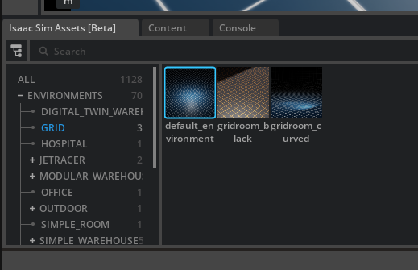
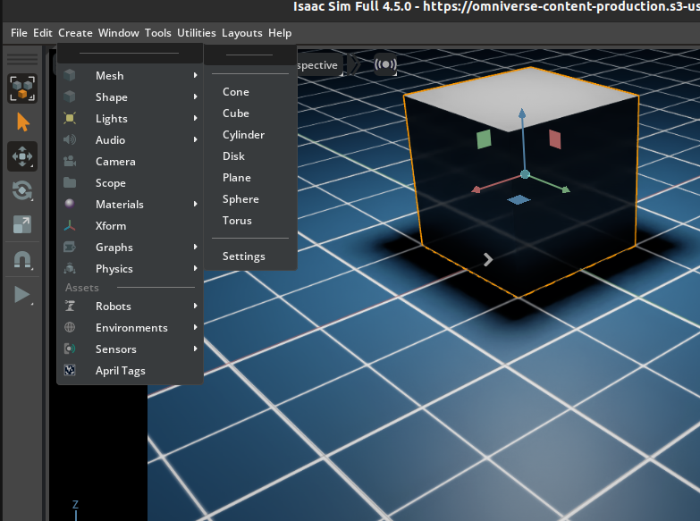
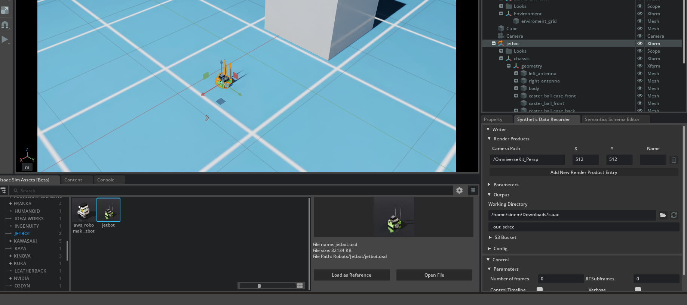
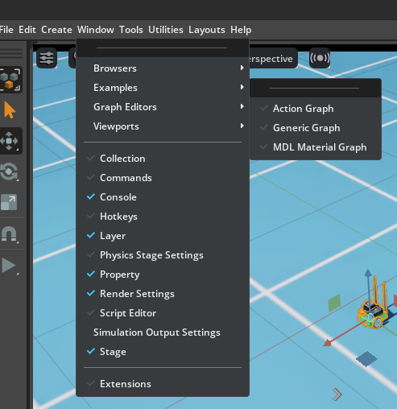
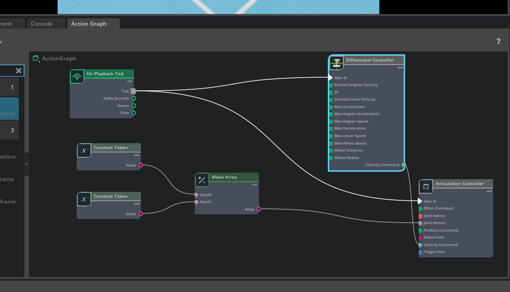

## Week 1 Starting With Isaac Sim

This week marks the beginning of my robotics simulation journey, starting with Isaac Sim a powerful, now open-source robotics simulator originally developed by NVIDIA, used for developing and testing robotics algorithms in realistic virtual environments.
This week, I’ll walk through the basics of getting started, including how to set up the environment, place a cube and a Jetbot robot into the scene, and move the Jetbot around.

For installing instructions, you can use this link as referanse which also includes some examples about Isaac Sim:  
[Isaac Sim in under half an hour](https://www.youtube.com/watch?v=SjVqOqEXXrY)

Here is the official documentation for Isaac Sim. I will mostly use this source as reference:  
[Isaac Sim Documentation](https://docs.isaacsim.omniverse.nvidia.com/4.5.0/ros2_tutorials/ros2_landing_page.html)

For Ros2 you can follow the official documantation to create a workspace. I will use a workspace that I create with the name 'ros2_ws' :  
[Ros2 Installation](https://docs.ros.org/en/foxy/Installation.html)

- First, we’ll create a simple environment. To do this, open Isaac Sim and go to the bottom-left panel labeled **Isaac Sim Assets**. From there, you can choose a grid environment  either default_environment or gridroom_curved. I used gridroom_curved for this example.
 

- To add a cube, we need to go to the upper left side, then choose Create -> Mesh -> Cube. You can then drag the cube anywhere with the arrows.
 
 

- To add the Jetbot, we need to return to the **Isaac Sim Assets** section and locate the Robot -> Jetbot subsection. There is two robot in there aws_robomaker_jetbot and jetbot. I am using jetbot for this example.
 

- After setting env we will follow this omnigraph tutorial to move our Jetbot: 
[Omnigraph Tutorial](https://docs.isaacsim.omniverse.nvidia.com/4.5.0/omnigraph/omnigraph_tutorial.html#isaac-sim-app-tutorial-gui-omnigraph)

- The above instructions don't exactly show how to control your jetbot with easier adjustments so you can try this short video:
[Adjustmants](https://www.youtube.com/watch?v=3u_cfkYq_Pg)

The following images are for giving more visual examples. 

 

 

 

I have add the usd file too but I recommend you to build yourself 