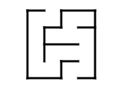
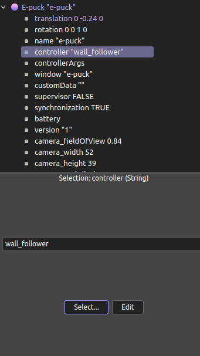

## Week 12 Wall Follower at Webots

https://github.com/user-attachments/assets/380141b5-65a5-431f-a8f4-af8734ecba5b

Isaac Sim brings thousands of problems to the table. I am trying to fix them, but there is always a new problem. So I will try another think at Webots to not feel stuck right now. I will follow this video tutorial:
[Wall Follower With Webots](https://www.youtube.com/watch?v=tHENC-HEIW8&list=PLbEU0vp_OQkUwANRMUOM00SXybYQ4TXNF&index=9)

We are gonna need [e-puck documentation](https://www.cyberbotics.com/doc/guide/epuck?version=cyberbotics:R2019a-rev1) too.

We put e-puck robot from Add(+) -> Proto Nodes -> Robot -> gctronic -> e-puck 
and we add a wall from Add(+)-> type wall to the find bar -> Wall(solid)
Wall is gonna be too big so we need to change the size below the wall node and I made it (x,y,z)(0.01,0.1,0.2).
 

 

Wall translation (0,0.07,0)
Wall rotation (x,y,z,angle) (0,0,1,1.57)

You can build your own maze by putting some walls around. I will use [maze generator](https://www.mazegenerator.net/).
I have generated a 4x4 maze to make it easier to build. 

This was the maze generated:
 

 

After I build the walls it looks like this:
 

 

Next step is to write the controller.
Don't forget to change the controller
 

 

Distance sensors look like this and green line means the sensor detects the object. (you can see distance sensor lines from View-> Optional Rendering -> ShowDistanceSensorRays)
 

 

To follow the wall, we will use the logic shown in the image. Similarly you can use the right sensors too.
 

 

Full code is in [wall_follower.py](wall_follower.py)