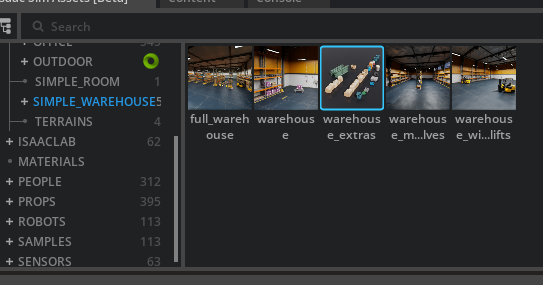

## Week 15 Isaac Sim Segmentation Script 

https://github.com/user-attachments/assets/0add84e1-ce11-4ce1-bc79-1f025cc6170b

This week, I will write the segmentation script. For this, we need a segmentation model, and I will use YOLO again. We will transform the .pt model into .engine with the same script from Week 14: [export_model.py](/Week14/export_model.py)

When we take the detect_rt code, there are only a few name changes, and the main change is in the process_segmentation function. The whole code is in there:
[Segmentation Script](segment_rt.py)

For testing, I added a few more objects to the scene.

The model still needs to be developed, especially for accuracy, and custom training is necessary. But I already spent too much time on this one, and I’m not sure if I should continue. To be honest, I want to work on different projects. This project already taught me a lot about Isaac Sim and how to work on things.