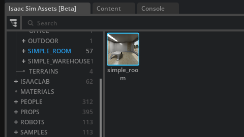
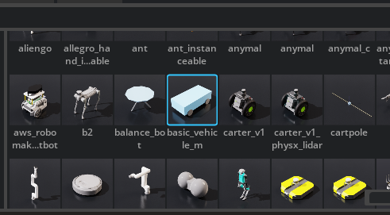
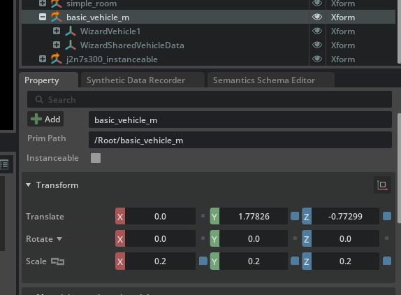
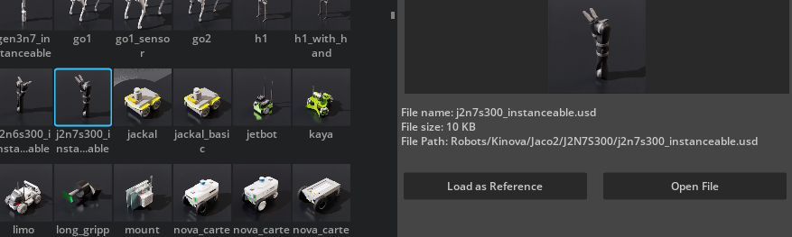

## Week 16 The Recycler Project Starting

This week, we are going to start a project aimed at creating a robot that can identify objects and place them in a designated location, such as a recycling bin. This project will be a simplified version to help me learn more about robotics.

I will share all the details about this project in a separate repository. I will post the link to that repository on LinkedIn when the project concludes.

I also want to share a sketch I created to illustrate my vision:
</br>

</br>
I may not be very skilled at sketching, but I believe this plan explains a lot. In this project, I will create a mobile robot with a arm. My goal is to learn more about robotics, so I am planning a simple example involving a green cube and a red cube, with buckets for each color placed in different corners of the room. The robot will be able to map the room, detect and grasp objects, and transfer them to the correct buckets automatically. I aim to complete this project in 14 weeks, although it might take longer. For the timeline, I am not counting this week as part of the 14 weeks.

Let's start with creating a new workspace:

```
mkdir -p ~/recycler_ws/src
```
Now I will add simple_room to our environment:
</br>

</br>

And I will add basic_vehicle to our environment:
</br>

</br>

This vehicle is quite large, so I will scale it. You can scale any item from the transform part, which we will do with the arm or other items too:
</br>

</br>


I am planing to use this for arm: 
j2n6s300_instanceable 
</br>

</br>

This is documantation for assets:

https://docs.isaacsim.omniverse.nvidia.com/5.1.0/assets/usd_assets_environments.html

This one for the robot assets:

https://docs.isaacsim.omniverse.nvidia.com/4.5.0/assets/usd_assets_robots.html

There are some built-in robots we can use, but I want to learn more about doing everything myself. For the mobile robot, I will start with simple ones, but for more advanced projects, I recommend ridgeback_franka or ridgeback_ur5.

It's all for this week, see you next week.

