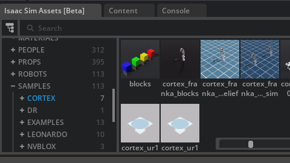
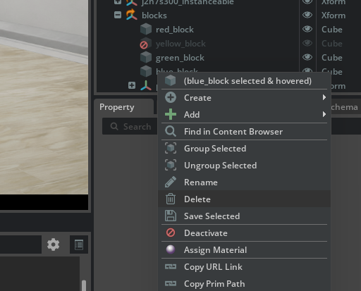
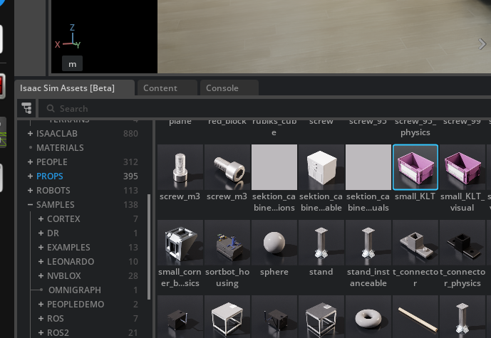
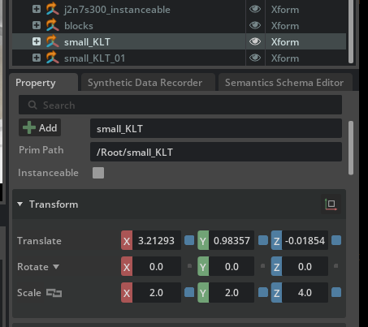
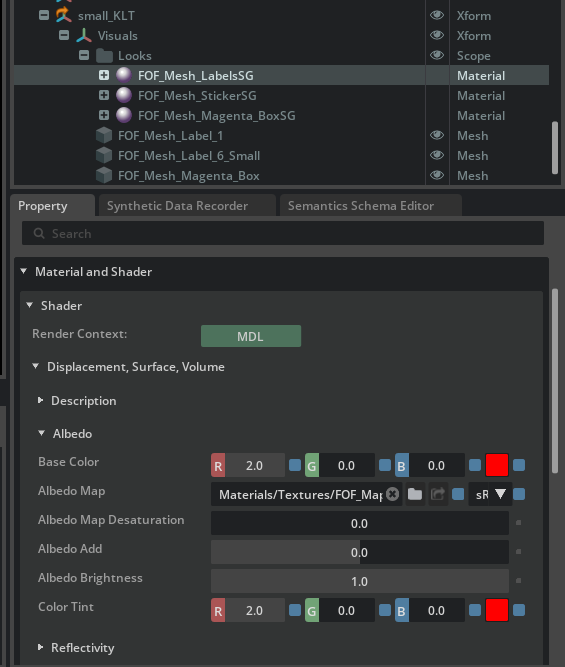
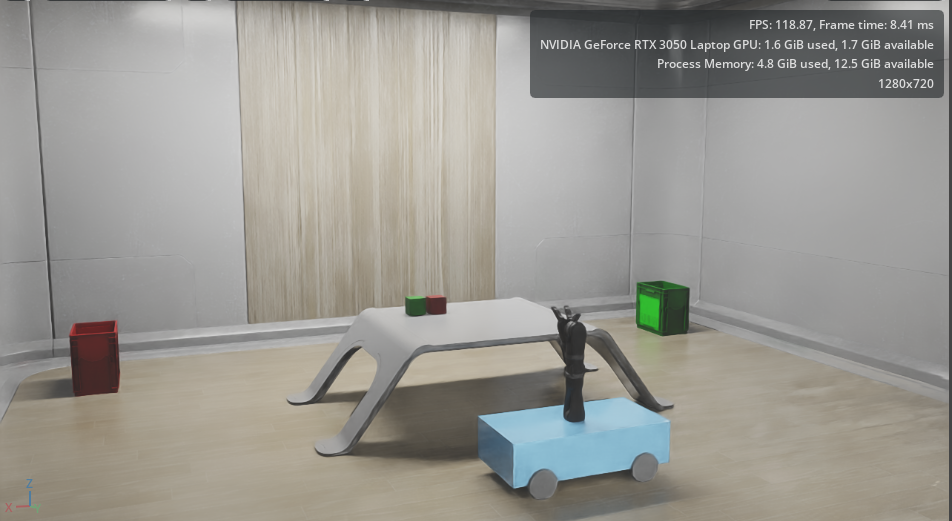
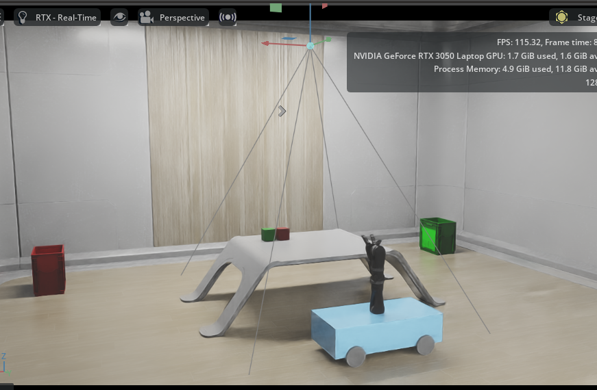
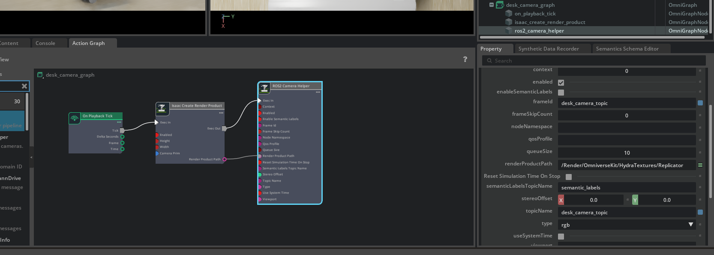

## Week 17 The Room 

I added the necessary blocks to the simulation. The image below shows the exact blocks I used:

I kept only the green and red blocks for this part of the project. Later projects can still use all four blocks together:

I changed the block’s scale for this setup:

I added a bin-shaped object to the simulation to represent the recycling bins:

I changed the scale of the recycling bin:

Change Recycling Bin Color:
I updated the recycling bin colors for better clarity.
Navigate to small_KLT → Visuals → Looks and select FOF_Mesh_Labels5G, FOF_Mesh_Sticker5G, and FOF_Mesh_Magenta_Box5G.
In the Property section, open Albedo and modify Base Color and Color Tint:

After applying these changes, the room now looks like this:

Next Step:
There is still a lot to do. Originally, the plan was to write a Python script to spawn two blocks onto the desk. I will implement that part later, but for now I placed a camera above the desk and published its output to a ROS 2 topic.

To add the camera:

Go to Create → Camera.

Rotate the camera by adding a transform: right-click the camera → Add → TransformOp → Transform, Rotate, Scale.

Set the Rotate X value to -90 in the Property panel.

Adjust the camera height as needed.

This is how it looks in my environment:

To process the camera data, we need to publish it to a topic. I followed this tutorial:
https://docs.isaacsim.omniverse.nvidia.com/4.5.0/ros_tutorials/tutorial_ros_camera.html

It looks like this at the end. You can see the topic name in the image below:

Now it’s time to begin coding, but I’ll be working on that next week.