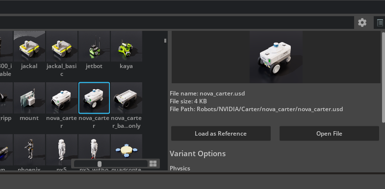

## The Spawning Cube 

In the link below, it shows how to use DynamicCuboid:
</br>
https://docs.isaacsim.omniverse.nvidia.com/5.1.0/python_scripting/core_api_overview.html

Gemini helped me with this pseudocode. This code manages the simulation environment by monitoring the workplace and ensuring recyclable objects (cubes) are always present.
```
CLASS CubeSpawner EXTENDS ROS_Node:

    INITIALIZE:
        DEFINE Desk_Boundaries (x_min, x_max, y_min, y_max)
        CREATE Queue for incoming camera frames
        SUBSCRIBE to topic "/desk_camera_topic"
        START Timer (runs every 0.5 seconds) -> CALL Logic_Loop()

    FUNCTION Image_Callback(new_frame):
        # Prevent processing lag by only keeping the newest frame
        IF Queue is NOT Full:
            PUSH new_frame to Queue
        ELSE:
            DROP new_frame (Log Warning)

    FUNCTION Logic_Loop():
        IF Queue is Empty:
            RETURN
        
        # 1. Perception
        image = GET latest frame from Queue
        CONVERT image to HSV format
        
        is_red_present   = Check_Pixels(image, RED_THRESHOLDS)
        is_green_present = Check_Pixels(image, GREEN_THRESHOLDS)

        # 2. Decision & Action
        IF NOT is_red_present:
            Spawn_Object("red")
            
        IF NOT is_green_present:
            Spawn_Object("green")

    FUNCTION Spawn_Object(color):
        # Randomization
        rand_x = RANDOM(x_min, x_max)
        rand_y = RANDOM(y_min, y_max)
        
        # Unique Naming (Required for USD Sim)
        unique_name = "Block_" + CURRENT_TIMESTAMP
        
        # Isaac Sim API Call
        CREATE DynamicCuboid(
            Path: "/World/blocks/" + unique_name,
            Position: (rand_x, rand_y, drop_height),
            Mass: Enabled (Physics),
            Color: color
        )

    FUNCTION Check_Pixels(image, color_range):
        mask = FILTER image using color_range
        pixel_count = COUNT non-zero pixels in mask
        
        IF pixel_count > 500:
            RETURN True  (Object Exists)
        ELSE:
            RETURN False (Object Missing)
```

I have decided to use another robot rather than basic vehicle and it's nova_carter :



Since nova_carter has two lidars it's gonna be easy to work with it, and it has the perfect scaling. Also I am thinking about changing the arm either because it is folded and when I run the simulation, it breaks the physics a little. 

Anyway, I have a lot of homework and finals ahead, so that was all I could do. See you next week.

