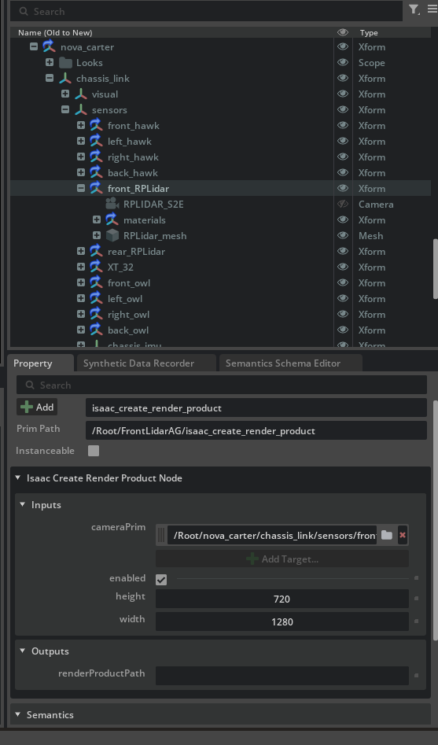
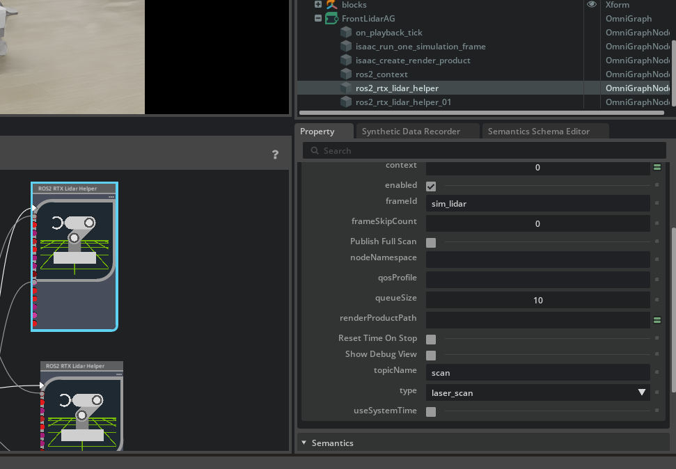
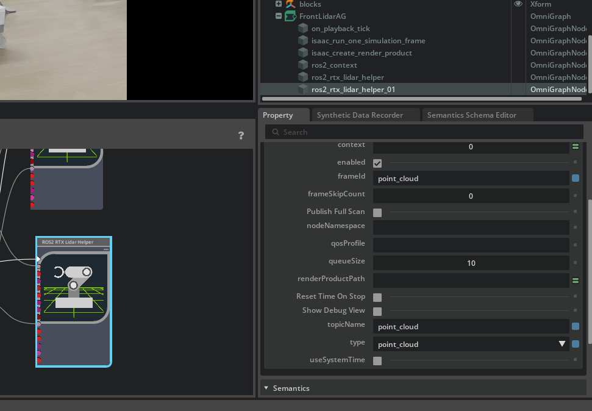
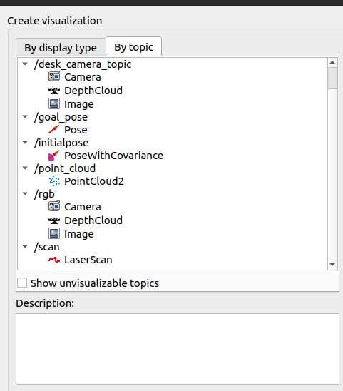
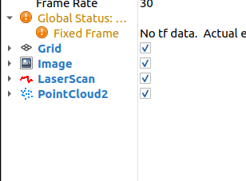
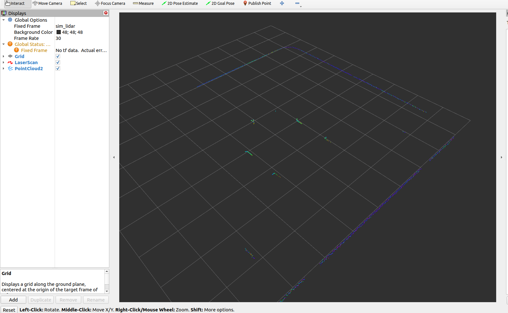
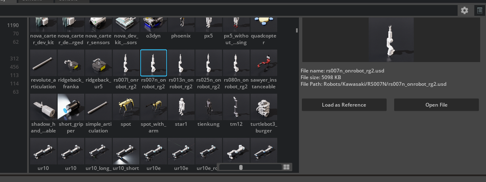
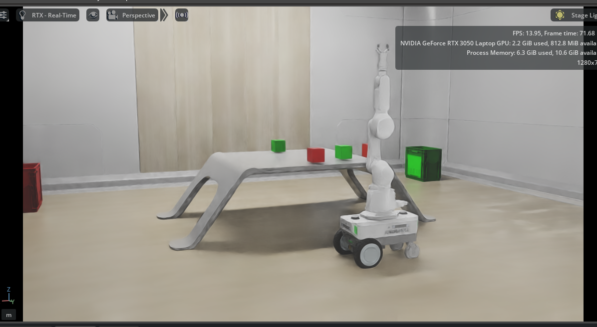

## Week 19 Fixing Cube Spawner and LIDAR

https://github.com/user-attachments/assets/07a81368-5a24-4f4a-a481-bd9a4eb73c05


#### Cube Spawner Fix

Last week, I wrote the initial cube spawner code, but it was incomplete, the execution logic was missing, which is why I was unable to run it at that time.

This week, after running the script directly from the Isaac Sim Script Editor, the spawner executed correctly.

I have now completed the missing execution part of the code and verified that it runs as expected.
Currently, two cubes are being spawned instead of one; this will be addressed later.

I also updated and fixed the code from previous weeks. Once this week’s changes are committed, the earlier implementation will be corrected as well.

The corrected version of the code is available here:

[The cube_spawner](cube_spawner.py)

#### RTX LiDAR Output from Neva Robot

Next step is taking LiDAR outputs from the Neva mobile robot. I followed the official Isaac Sim documentation:

https://docs.isaacsim.omniverse.nvidia.com/4.5.0/ros2_tutorials/tutorial_ros2_rtx_lidar.html


The Action Graph is configured as shown below:
</br>


</br>

For the Isaac Create Render Product node, the cameraPrim must be set to the LiDAR sensor.
In this case, I selected the RPLIDAR_S2E mounted on the robot:
</br>



</br>

The LiDAR Helpers are configured as follows.

Helper 1:
</br>



</br>

Helper 2:
</br>



</br>

After running the simulation, I launched RViz using:
```
rviz2
```
Then I added both LaserScan and PointCloud2 displays:
</br>



</br>

On the left panel, the configuration should look like this:
</br>



</br>

At the end, the RViz output should look like the image below.
Make sure the Fixed Frame is set correctly. I used sim_lidar:
</br>



</br>

#### Robot Update

I also updated the robot arm. The new arm is shown below:
</br>



The current room setup looks like this:
</br>



</br>

There is still a lot to do:

- Physics-related fixes

- Making the mobile robot fully drivable

- Setting up SLAM

- Saving a map of the room

It’s going to be challenging, but also fun 🚀

🎄 Merry Christmas! Happy New Year!

I also have finals coming up, so progress may slow down for the next two weeks.