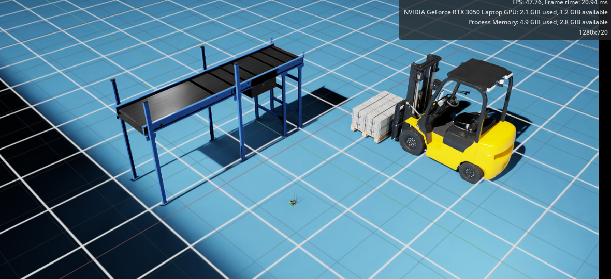
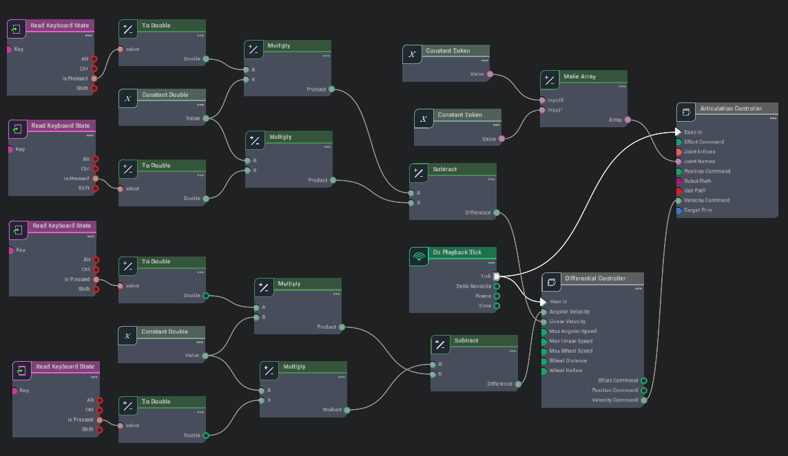
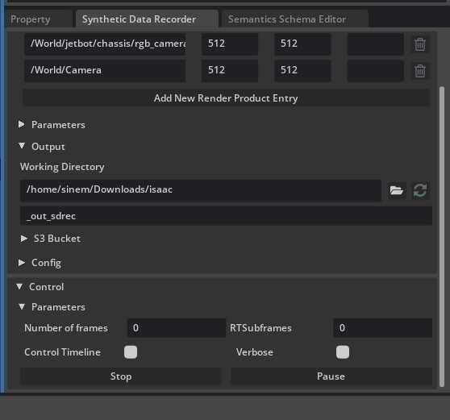
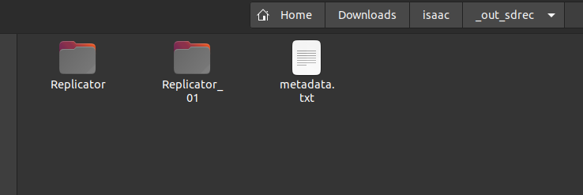
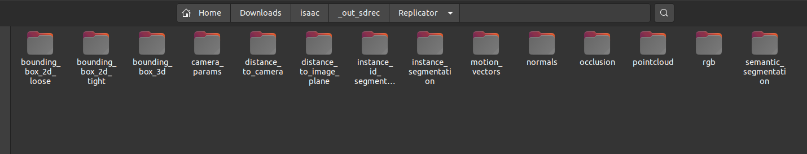

## Week 2 Synthetic Data with Isaac Sim

In this week, we will learn how to collect synthetic data from Isaac Sim. Additionally, we will learn how to control the jetbot using our keyboard by creating an Omnigraph.

- First, I create an environment that enhances productivity and facilitates the collection of synthetic data. The goal of this environment is to establish separate workspaces. I only use **Isaac Sim Assets** for this. In my setup, I include one forklift, one pallet, and one conveyor belt. You can add any other components you wish, and feel free to create more complex environments based on your GPU capabilities. For example, I can design something like this.
 

 

- After setting up the environment, we will control our jetbot using the keyboard. We will utilize the W, A, S, and D keys for movement. While you can refer to Isaac Sim's OmniGraph tutorial shared in week 1, I don't recommend it because it only provides a visual of the OmniGraph without explaining how to configure any other nodes for moving the jetbot.
 

- Instead, I found another tutorial that is in Chinese, but you can translate it into English.
  
[The Tutorial](https://developer.aliyun.com/article/1592535)
 
The most important aspects of this tutorial involve the "Read Keyboard State" node and the "Constant Double" node. You need to adjust the "Read Keyboard State" node to correspond with the linear and angular velocities. Specifically, assign the linear velocity to the W and S keys and the angular velocity to the A and D keys. Next, you'll need to modify the "Constant Double" settings. The Chinese tutorial suggests values around -+3, but I recommend using -40 to -50 for linear velocity and 6 to 12 for angular velocity. I find that -50 for linear velocity and 12 for angular velocity yield smoother movement. This is how I set up my controllers.

- The next step is to collect synthetic data from IsaacSim. To do this, find the section at the bottom right labeled **Synthetic Data Recorder**. You need to add a new render product entry. For the first entry, select the camera from your jetbot. For the second entry, you can add cameras positioned around your environment to gather more data as your robot moves. You can add as many cameras and views as you like to capture different angles. Additionally, there's an "_out_sdrec" directory option where you can change the directory path to any location you prefer within the working directory. Be sure to set the parameters for the type of data you want to collect. By default, the system collects RGB data (RGB images), but I recommend experimenting with some of the advanced segmentation options available. For this example, I selected all options in the parameters section to have a comprehensive dataset to work with. Once everything is set up correctly, you can start recording your data using the **Start** and **Stop** buttons. When you click the **Start** button, you also need to initiate your simulation and move your jetbot around to collect diverse data from the environment.
 

 

- The directory containing the collected data appears as shown in the following images.
 

 

