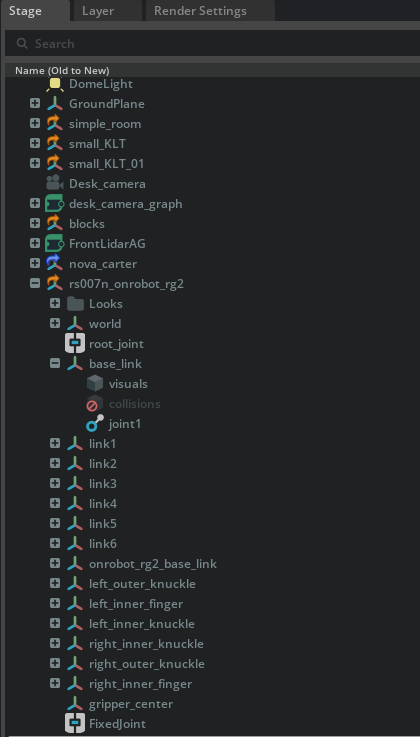
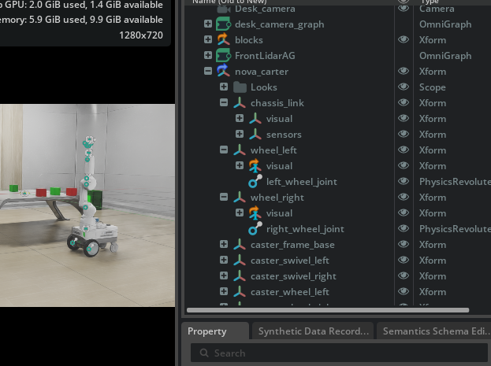

## Week 20 Linking the Arm and Driving the Base (Failed)

This week focused on **physically linking a robotic arm to a mobile base** and enabling the robot to drive as a single articulated system.

Before driving the base robot, the arm and the base must be correctly linked in the physics simulation.

---

### Linking the Arm to the Base

#### 1. Selecting Both Parts
- Click the **Nova chassis** (`chassis_link`)
- Hold **Ctrl** and click the **arm base** (`base_link`)

#### 2. Creating a Fixed Joint
- Right-click in the viewport  
- Select **Create → Physics → Joint → Fixed Joint**

#### 3. Disabling Articulation on the Arm
- Open the **Property** tab  
- Scroll to **Physics → Articulation Root**
- **Disable** it

This merges the arm into the base robot instead of treating it as a separate articulated system.

---

### Objects Flying Issue (Arm & Cubes)

After linking, the arm and nearby objects suddenly **started flying**.

#### Why This Happened
When **Articulation Enabled** was unchecked on the arm:
- The simulator treated the arm as a rigid part of the Nova Carter
- Collision geometry between the arm and chassis overlapped
- PhysX detected **self-collision** and applied extreme forces

Result: parts violently separated.

#### Fix
- Move the arm **slightly away** from the Nova Carter
- Carefully reposition it without collision overlap

This resolved the instability.

### After Fix


---

## Collision Cleanup

To reduce instability:
- Open the **Stage Tree**
- Navigate to the arm’s `base_link`
- Find `collisions` or `collision_mesh`
- Right-click → **Delete**

> This is acceptable for visualization and kinematic testing, but not recommended for full physics interaction.

---

### Driving the Robot

After linking, the robot visually behaved correctly.  
Driving was attempted using [Week 1 and](Week1/Week1.md) [Week 2 tutorials](Week2/Week2.md), but an issue appeared:

 **The wheels had no joints defined**

---

### Adding Wheel Joints Manually

#### Left Wheel
- Select **Parent**: `chassis_link`
- Hold **Ctrl** and select **Child**: `wheel_left`
- Go to **Create → Physics → Joint → Revolute Joint**
- Rename it to: `left_wheel_joint`

#### Right Wheel
Repeat the same steps and rename it to:
- `right_wheel_joint`

### After Fix


---

### Articulation Root Fix Attempt

Errors indicated the robot was not recognized as a valid articulation.

Steps taken:
- Select the robot parent (e.g., `/World/nova_carter`)
- In the **Property Tab**, check for:
  - `Physics → Articulation Root`
- If missing:
  - Click **+ Add → Physics → Articulation Root**

---

### Remaining Errors

Despite these steps, the following errors persist:

```text
[Error] [omni.physx.tensors.plugin] Pattern '/Root/nova_carter/chassis_link' did not match any rigid bodies

[Error] [omni.physx.tensors.plugin] Provided pattern list did not match any articulations
```

### Note

Since it’s my finals week, I won’t be able to share anything next week.  
Unfortunately, this state will stay as-is until I finish my exams.

Wish me luck.  
And happy **2026** everyone. 🎉