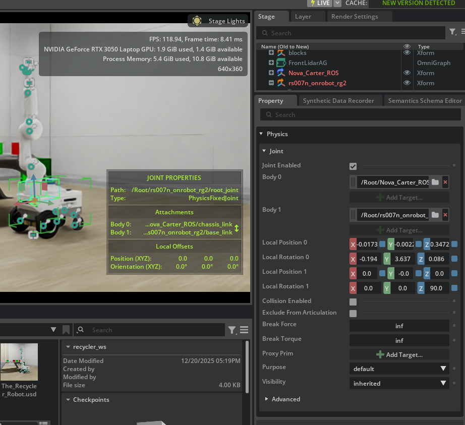

## Week23 Some Problems Fixed, Never Give Up!

I tried the "On Tick" node with an action graph I made before but it didn't work. I am investigating the problem.

```
2026-02-17 12:44:24 [11,252ms] [Error] [isaacsim.ros2.bridge.scripts.extension] ROS2 Bridge startup failed
```

I encountered an error while running the script, and I believe it is related to this issue. 

The bridge was causing our action graph to malfunction, which prevented me from taking the necessary readings from the simulation. As a result, I was unable to start the ride and perform the SLAM mapping.


To fix the bridge I tried: 
```
sudo apt install ros-humble-rmw-fastrtps-cpp

export RMW_IMPLEMENTATION=rmw_fastrtps_cpp

export ISAAC_ROOT="/home/sinem/Desktop/isaac"

export LIB_PATH="$ISAAC_ROOT/exts/isaacsim.ros2.bridge/humble/lib"

export LD_LIBRARY_PATH=$LIB_PATH:$LD_LIBRARY_PATH

./python.sh THE/SCRIPT/PATH

```


But I still have the following errors:

```
[ERROR] [1771579054.712056563] [rcl]: Error getting RMW implementation identifier / RMW implementation not installed (expected identifier of 'rmw_fastrtps_cpp'), with error message 'failed to load shared library 'librmw_fastrtps_cpp.so' due to dlopen error: librmw_fastrtps_cpp.so: cannot open shared object file: No such file or directory, at /workspace/humble_ws/src/rcutils/src/shared_library.c:99, at /workspace/humble_ws/src/rmw_implementation/src/functions.cpp:65', exiting with 1., at /workspace/humble_ws/src/rcl/rcl/src/rcl/rmw_implementation_identifier_check.c:139


2026-02-20 09:17:34 [7,537ms] [Error] [isaacsim.ros2.bridge.scripts.extension] ROS2 Bridge startup failed
```

I saw CycloneDDS is solving the problem ([from this source](https://github.com/ros2/rmw_cyclonedds/issues/478)) and when I downloaded and changed the script because Isaac Sim is recalibrating my terminal configuration this one worked.

```
sudo apt install ros-humble-rmw-cyclonedds-cpp

source /opt/ros/humble/setup.bash

./python.sh THE/SCRIPT/PATH

```

From another terminal source, the ros and run this

```
ros2 topic list

```

and these was the output

```
/back_stereo_imu/imu
/chassis/imu
/chassis/odom
/cmd_vel
/desk_camera_topic
/front_3d_lidar/lidar_points
/front_stereo_camera/left/camera_info
/front_stereo_camera/left/image_raw
/front_stereo_camera/right/camera_info
/front_stereo_camera/right/image_raw
/front_stereo_imu/imu
/left_stereo_imu/imu
/parameter_events
/point_cloud
/right_stereo_imu/imu
/rosout
/scan
/tf

```

So it is working Yeayy!


The table below displays the topics we need for the next steps:


| If you want to.   .. | You need this Topic | Isaac Sim Node Required
|----------|----------|----------|
| Drive Manually | /cmd_vel | ROS2 Subscribe Twist
| Run SLAM | /scan | ROS2 Publish LaserScan
| Run SLAM | /odom | ROS2 Publish Odometry
| Run SLAM | /tf |ROS2 Publish Transform Tree
</br>


If you remember the robot connection problem, I am close to fixing that too.

When I opened my simulation in Isaac Sim and clicked on the 'root joint' of the arm, I noticed that it was connected to the world instead of the Nova robot. From Body 0, I selected Nova Carter's chassis link and manually fixed the joint's connection.



 After saving the simulation, I ran the working script, but encountered an error. It turned out that some leftover connections to the world were corrupting the correct connection to Nova Carter.

```
2026-02-20 12:10:51 [17,843ms] [Error] [omni.physx.plugin] RigidBody (/Root/rs007n_onrobot_rg2/base_link) appears to be a part of a closed articulation, which is not supported, please exclude one of the joints:
/Root/Nova_Carter_ROS/joint_caster_base
/Root/Nova_Carter_ROS/joint_swing_left
/Root/Nova_Carter_ROS/joint_swing_right
/Root/Nova_Carter_ROS/joint_caster_left
/Root/Nova_Carter_ROS/joint_caster_right
/Root/rs007n_onrobot_rg2/root_joint
/Root/Nova_Carter_ROS/dummy_link/FixedJoint
/Root/Nova_Carter_ROS/dummy_link_2/FixedJoint
/Root/Nova_Carter_ROS/joint_wheel_left
/Root/Nova_Carter_ROS/joint_wheel_right
/Root/rs007n_onrobot_rg2/base_link/joint1
/Root/rs007n_onrobot_rg2/link1/joint2
/Root/rs007n_onrobot_rg2/link2
/Root/rs007n_onrobot_rg2/world/world2base
 from articulation, the joint will be now excluded from the articulation.
```

I am frustrated that Cuda keeps uninstalling itself on Ubuntu. This has happened again, and I need to resolve this issue before continuing. 

Next week, I will show you which parts need fixing to properly connect your arm to the base. We will also drive the robot around and finally obtain the map using SLAM.