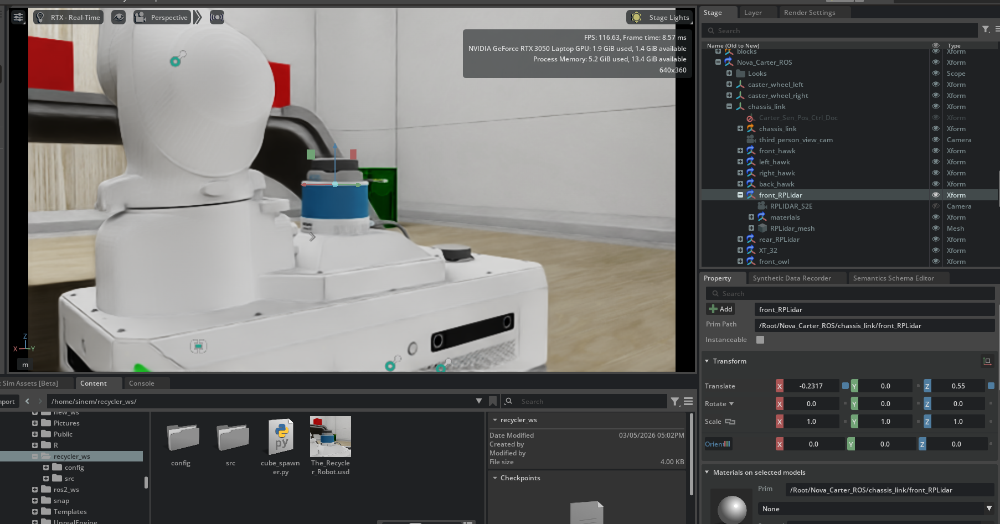
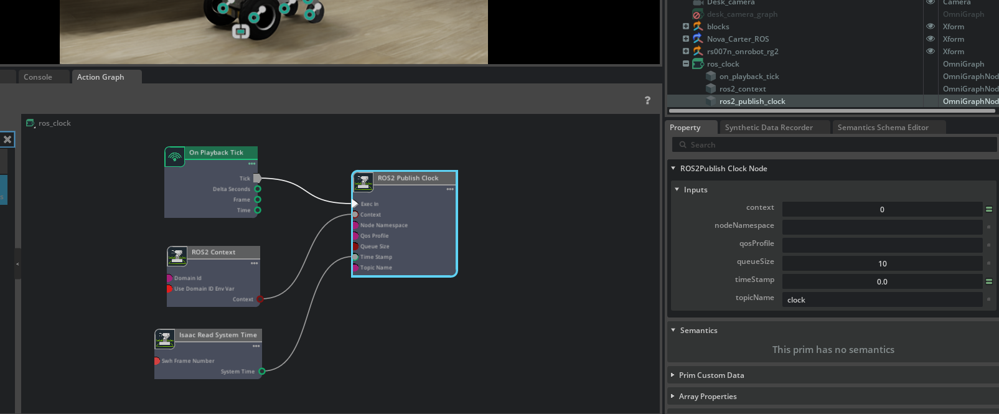
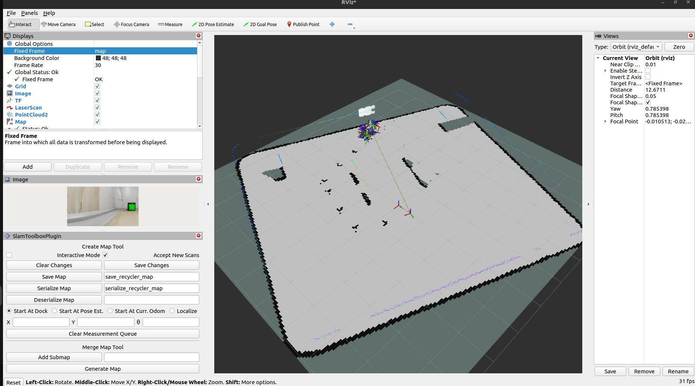

## Week25 SLAM

To address the issue of the laser scanner not providing any data, I attempted to change the location of the front lidar, but that didn't resolve the problem. I also enabled 'Debug View' and 'Publish Full Scan' for the node in the action graph, and adjusted the visibility settings of the lidar, but none of these changes worked. 

I checked RViz to ensure that I wasn't visualizing incorrectly, and I couldn't find any issues there. Upon reviewing old recordings, I realized that before I attempted to link the arm with the base, the laser scan was producing outputs. I'm still unsure where the problem started, so I will investigate the steps I took during the linking process. Additionally, I will revisit the changes I made to the lidar.

I deleted the action graph I made for front lidar, and I can't see any scan topic anymore, so there is definitely a problem with the laser scan of the Nova Carter. I will check their action graph and documentation in case I am missing something.

https://docs.isaacsim.omniverse.nvidia.com/4.2.0/landing_pages/nova_carter_landing_page.html


I found that my robots might have problems because their names are red at Isaac Sim.

Click on the red Nova_Carter_ROS prim in your Stage tree.

Look down at the Property panel and scroll to the very bottom.

Look for a section called References or Payloads.

You will likely see a broken link there that have red names.

Delete that part from right side.

Make same think for the arm too. 

I tried this, names are not red anymore, but I still can not see scan topics.

I noticed there are more topics are not been published. Also I try to add nova carter to an empty world and some topics was still missing. So it is something about nova carter. I guess that was for performance saving but I will look if it have anythink to do with my lidars.

Yes it was! Apperantly at the ros_lidars action graph product nodes(nodes to take the data from lidars) was not enabled. When I enabled tham I was able to see the scan topics.

```
 ros2 topic list
 
/back_2d_lidar/scan
/back_stereo_imu/imu
/chassis/imu
/chassis/odom
/cmd_vel
/front_2d_lidar/scan
/front_3d_lidar/lidar_points
/front_stereo_camera/left/camera_info
/front_stereo_camera/left/image_raw
/front_stereo_camera/right/camera_info
/front_stereo_camera/right/image_raw
/front_stereo_imu/imu
/left_stereo_imu/imu
/parameter_events
/right_stereo_imu/imu
/rosout
/tf

```

Now we can visualize the laser scan at rviz but before that, our front lidar was located under the arm so I changed the position as
</br> [x y z][-0.2 0.0 0.55]. It looks like this after the relocation:
</br>

</br>

And we visualize that at rviz 

https://github.com/user-attachments/assets/4eba15f1-2c05-4032-bf5d-a22a528062dc


Let's run SLAM

[I learned from this video.](https://www.youtube.com/watch?v=ZaiA3hWaRzE
)

I am having map not received problem at rviz I am investigating that. As soon as I solve it, I will explain how to fix if you have this kind of problem.

I guess Isaac Sim was not giving the time parameter to the SLAM, so we should add an action graph. [I will follow this tutorial](https://docs.isaacsim.omniverse.nvidia.com/4.2.0/ros2_tutorials/tutorial_ros2_clock.html#isaac-sim-app-tutorial-ros2-clock-publisher) 

For reference, it looks like this:
</br>

</br>


```
ros2 run slam_toolbox async_slam_toolbox_node --ros-args -p use_sim_time:=true -p odom_frame:=odom -p base_frame:=base_link -p scan_topic:=/front_2d_lidar/scan -p mode:=mapping
```

This one finally worked.

https://github.com/user-attachments/assets/87cd02b4-875a-4163-975b-b5cbf36f0d31

To save the map, I followed exact steps from the video above.
</br>

</br>