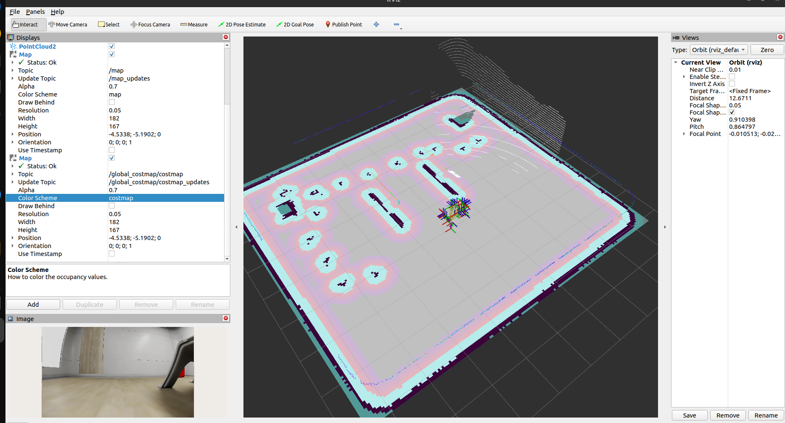

## Week26 Exploring SLAM and NAV2

I will attempt to open SLAM using the saved map. However, when I try to open SLAM from the parameter (.yaml) file, I cannot do that. I will investigate why I cannot open it this way.

```
ros2 launch slam_toolbox online_async_launch.py slam_params_file:=/home/sinem/recycler_ws/config/mapper_params_online_async.yaml use_sim_time:=true
```

This command should work, but it did not. For some reason, I am experiencing a time complexity issue, and Odom is throwing warnings.

```
scan_topic: /front_2d_lidar/scan

transform_timeout: 0.5
```

I have only changed this in the .yaml file.

It did not worked. 

```
[async_slam_toolbox_node-1] [INFO] [1773055102.386885959] [slam_toolbox]: Message Filter dropping message: frame 'front_2d_lidar' at time 0.150 for reason 'the timestamp on the message is earlier than all the data in the transform cache'

[async_slam_toolbox_node-1] [WARN] [1773054804.601993338] [slam_toolbox]: Failed to compute odom pose
```
The second warning keeps reappearing. For now, I will proceed by entering the parameters in the command line, as I don’t want to waste too much time on this issue. I may revisit it later, and if I discover anything new, I will let you know. For now, I would like to continue trying to open SLAM using the saved map.

```
ros2 run slam_toolbox async_slam_toolbox_node --ros-args -p use_sim_time:=true -p odom_frame:=odom -p base_frame:=base_link -p scan_topic:=/front_2d_lidar/scan -p mode:=localization -p map_start_at_dock:=true -p map_file_name:=/home/sinem/recycler_ws/serialize_recycler_map
```
The command above opens the map correctly. However, I made a mistake while mapping the room, as I used the odom topic as the fixed frame. When I opened the map with the map topic set as the fixed frame, it appeared a bit off. I will redo the steps for running SLAM with my robot, saving the map again, and then reopening it from the saved version. In the video above, you can see the incorrect approach I took.

https://github.com/user-attachments/assets/8d622235-d208-4067-9883-5c68a13ffb78

And this is the correct one.

https://github.com/user-attachments/assets/5649d036-54f4-428e-af15-631e0422f0fc

Let's start navigation. Again, I will use [this video](https://www.youtube.com/watch?v=jkoGkAd0GYk) as a guide for navigation.

First things first, let's download NAV2

```
sudo apt install ros-$ROS_DISTRO-navigation2
sudo apt install ros-$ROS_DISTRO-nav2-bringup
```

Nav2 is basically gonna allow us to tell your robot which direction it should go.

```
ros2 launch nav2_bringup navigation_launch.py use_sim_time:=true
```
Open RViz and add another map. In the topic section of the map, select /global_costmap/costmap and choose 'costmap' for the color scheme. It should appear like this:



Now it's time to move our robot to the desired destination. In the upper part of RViz, click on the "2D Goal Pose" button. After that, click on the map at the location where you want your robot to go. An arrow will appear, indicating the direction your robot should face.

I encountered a problem with my robot's arm. As you can see in the picture, my robot has some footprints that cause Nav2 or SLAM to detect obstacles, even when there’s nothing in the way. As a result, when I set a destination using the 2D Goal Pose, my robot moves but cannot reach the destination. I plan to investigate this issue next week. 