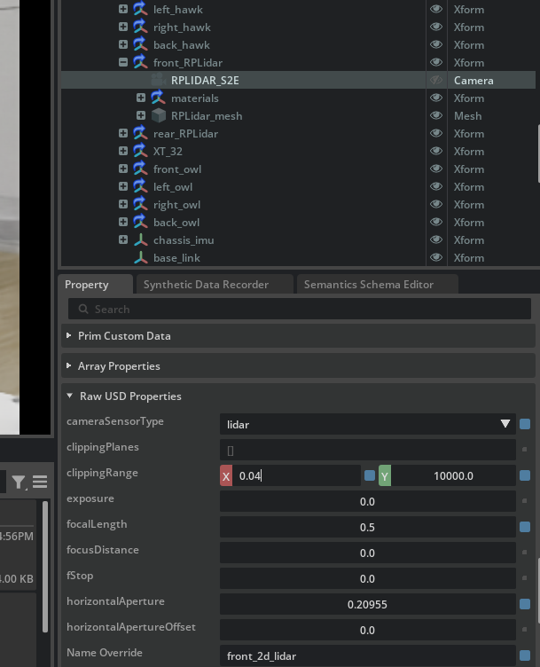

## Week27 Trying to Delete Footprints (Failed)

I am trying to solve the footprint problem at my map. I will try laser-filter first let's see if this can solve our problem.

```
sudo apt install ros-humble-laser-filters
```

at the recycler_ws/config I created a file called arm_filter.yaml which have the following things inside:

https://wiki.ros.org/laser_filters#LaserScanBoxFilter

```
scan_filter_node:
  ros__parameters:
    filter1:
      name: arm_blindspot
      type: laser_filters/LaserScanBoxFilter
      params:
        box_frame: base_link
        # Adjust these coordinates to draw a box perfectly around your arm!
        max_x: 0.6   # How far forward the box goes
        max_y: 0.6   # How far left
        max_z: 1.0   # How high 
        min_x: 0.6   # Where the box starts 
        min_y: -0.6  # How far right
        min_z: -1.0  # How low
```
and I run the following commands in different terminals:

```
 ros2 run laser_filters scan_to_scan_filter_chain --ros-args --params-file ~/recycler_ws/config/arm_filter.yaml --remap scan:=/front_2d_lidar/scan

ros2 run slam_toolbox async_slam_toolbox_node --ros-args -p use_sim_time:=true -p odom_frame:=odom -p base_frame:=base_link -p scan_topic:=/scan_filtered -p mode:=mapping
```

But this method didn't solve my footprint problem.

I've also tried the following yaml file, but it did not work either:
```
scan_filter_node:
  ros__parameters:
    filter1:
      name: arm_angle_filter
      type: laser_filters/LaserScanAngularBoundsFilter
      params:
        lower_angle: -0.5   
        upper_angle:  0.5
```

Also, I tried with several numbers for each yaml file.

I will try a method that I know I shouldn't be using. I plan to manually delete the footprints. 

To do this, I will use GIMP to paint over the unnecessary obstacles in white. I understand that this is not the most effective method, but I don't want to waste time because this is a learning project. I have already learned a technique for filtering scans to remove footprints, but it isn't working for me right now. Perhaps it will work as expected once I've made some adjustments to the arm and gripper, as my arm still lacks certain configurations.

Unfortunately, this current approach is not working.

I guess I found a way. I opened Isaac Sim, and for my front lidar I changed Raw USD Properties > clippingRange to 0.4
</br>



Let's try again. For some reason, the map and robot are shifting in RViz, but I don't see any movement from the robot itself.

```
[ERROR] [1774622243.495484495] [rviz2]: Lookup would require extrapolation into the future.  Requested time 1.599969 but the latest data is at time 1.550000, when looking up transform from frame [front_2d_lidar] to frame [map]
```

Running the following command helped resolve the issue with Rviz2. Since I set the fixed frame to "map," I must run the slam command first; otherwise, Rviz throws the same error again.

```
ros2 run rviz2 rviz2 --ros-args -p use_sim_time:=true
```

For some reason, I still have the footprint issue. I will try adjusting the clipping range again. I initially tested values of 0.4 and 0.6, but they didn't help. Then I tried 0.5 and 0.7, and after measuring the distance using the tool in Isaac Sim (which you need to enable from the extensions), I attempted a value of 2.6. However, that caused RViz to display the same error again, so I reverted to 0.8, but I still have the footprint.

This method isn't working, so I will retry the laser filter. I have attempted it again, but it still isn't functioning properly.


I found the exact problem I have, but there is no promised solution. I will look anyway.

https://forums.developer.nvidia.com/t/robot-is-leaving-obstacle-marks-while-mapping-manually/312581/3

I need to modify a system file, but I'll keep that in mind and only attempt it if I have no other options left. The suggested solution involves adding something to the LIDAR system file, but it feels risky to me because I have a history of accidentally deleting system files on Ubuntu.

I find out some people also said the laser_filter is not working. Look at this source :
https://github.com/ros-perception/laser_filters/issues/178

I attempted to download the laser_filter from the GitHub page mentioned in the solution, but it hasn't changed anything. I also noticed a timing issue similar to the one with RViz in SLAM. Additionally, I added the use_sim_time parameter to the filter command, but that didn't resolve the issue either. I plan to search for solutions next week, but I can’t guarantee a fix since everything appears to be working, yet it can break unexpectedly. Nevertheless, I will not give up.
