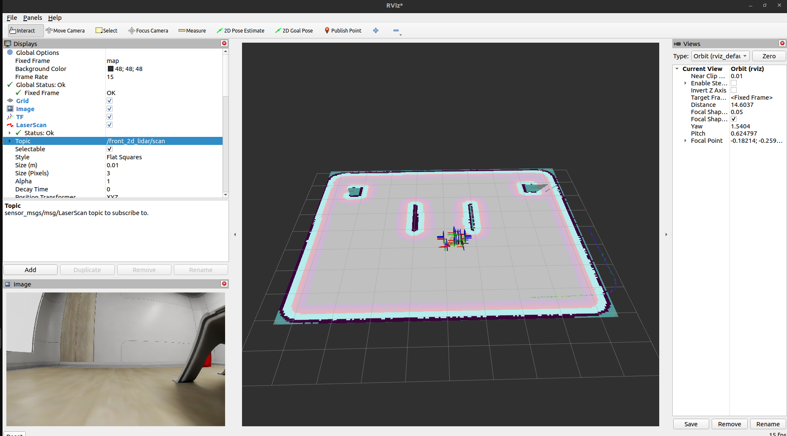
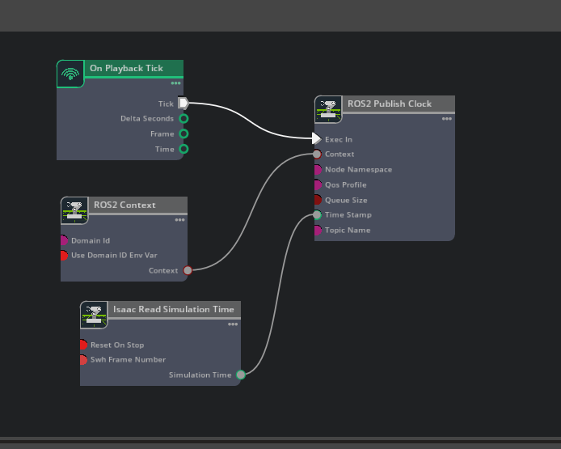

## Week 28 Finally! Clean Map and Moving Robot with NAV2

https://github.com/user-attachments/assets/c59b1e82-3862-4d02-b837-68c1ad24a2b9

Add -p transform_timeout:=0.5 to the slam command and try again. I tried it, but it didn't solve the issue.

/tf publish rate:          ~52 Hz  <- fast
/front_2d_lidar/scan rate:  ~6.5 Hz  <- very slow

I discovered that this was causing the problem, and I am looking for a solution.

```
world = World(
    physics_dt=1/200,    # physic at 200Hz (keep high)
    rendering_dt=1/30,   # render at 30Hz → lidar at 30Hz
    stage_units_in_meters=1.0
)
```

I will attempt to change this part in the headless script. Hopefully, it works. 
However, it did not work.

I will try this solution I found last week:
https://forums.developer.nvidia.com/t/robot-is-leaving-obstacle-marks-while-mapping-manually/312581/3

Go to this exact folder:
~/.local/share/ov/pkg/isaac-sim-4.5.0/exts/omni.sensors.nv.lidar/data/lidar_configs/
(I am using Isaac Sim open source version right now so if you do too, here is the file path:
~/isaac/exts/isaacsim.sensors.rtx/data/lidar_configs/SLAMTEC/
)

Open the .json file that matches your sensor (like RPLIDAR_S2E.json) in a text editor. Add this exact line to the list of parameters:
"rangeOffset": 0.3,

It is working. I have the perfect map.
</br>



</br>

But my robot still did not move. I have the following error:
```
[controller_server-1] [ERROR] [1776423052.289124858] [tf_help]: Transform data too old when converting from map to odom
[controller_server-1] [ERROR] [1776423052.289142417] [tf_help]: Data time: 1776423052s 117855744ns, Transform time: 2s 750031367ns
```
Again, there is a time error. I am trying to find some solutions.

I noticed there was a problem in my clock action graph. Here is the old one:


But I was supposed to use Isaac Read Simulation Time. This was the reason why I had that much time errors. Here is the corrected one:



After this, everything is working now. 

Also, I am using another command for SLAM:
```
ros2 launch slam_toolbox localization_launch.py slam_params_file:=/recycler_ws/mapper_params_localization.yaml use_sim_time:=true
```
mapper_params_localization.yaml is like that:

```
slam_toolbox:
  ros__parameters:
    use_sim_time: true
    odom_frame: odom
    base_frame: base_link
    map_frame: map
    scan_topic: /front_2d_lidar/scan
    mode: localization
    map_file_name: /home/sinem/recycler_ws/perfect_map_serialize
    map_start_at_dock: true
```

