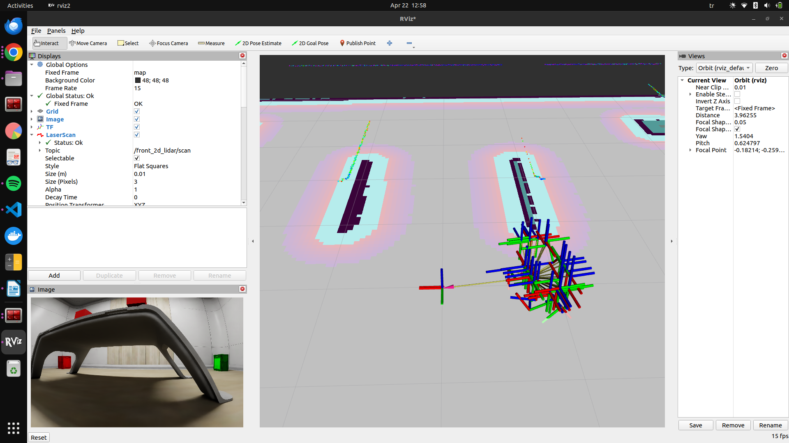
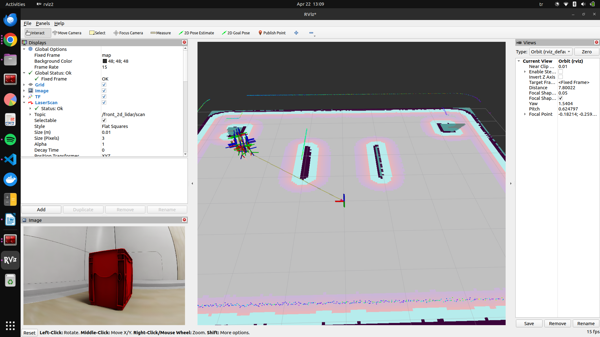
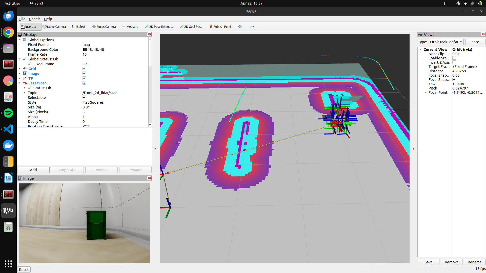

## Week29

We need to move the robot to the side of the desk, as it will later grab the boxes. We will also position it near the red and green boxes and record the coordinates. Finally, we will write a script to enable our robot to operate autonomously.

Coordinates:

- The Desk :Position(-1.00143, -0.0194793, 0), Orientation(0, 0, -0.542605, 0.839988) = Angle: -1.14707

- Red Box:Position(3.01234, -2.46986, 0), Orientation(0, 0, -0.611311, 0.79139) = Angle: -1.31543

- Green Box: Position(-2.78368, -2.34036, 0), Orientation(0, 0, -0.819903, 0.572503) = Angle: -1.92248

I've noticed that it sometimes gets stuck on the legs of the desk, so we need to keep this in mind while writing the script.

I still encounter the time error in RViz, but to be honest, I don't know why, and I can't be too concerned about it anymore.

I found some sources to use for writing the script. Here they are;

The library we should use:
https://docs.ros.org/en/iron/p/nav2_simple_commander/

An example from the libraries repo:
https://github.com/ros-navigation/navigation2/blob/main/nav2_simple_commander/nav2_simple_commander/example_nav_to_pose.py

I will use these sources as a guide. I had a lot going on this week, so I will write the script next week. I apologize for not being able to share more.