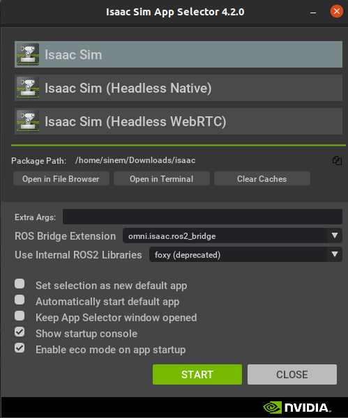
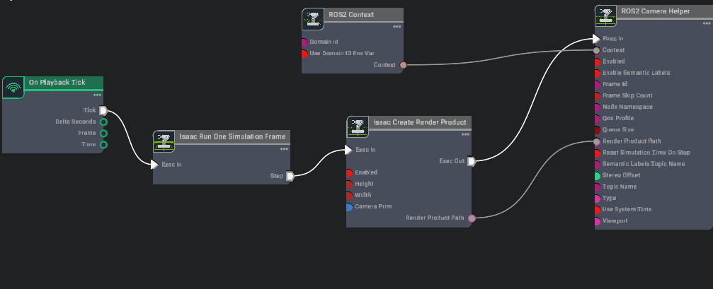
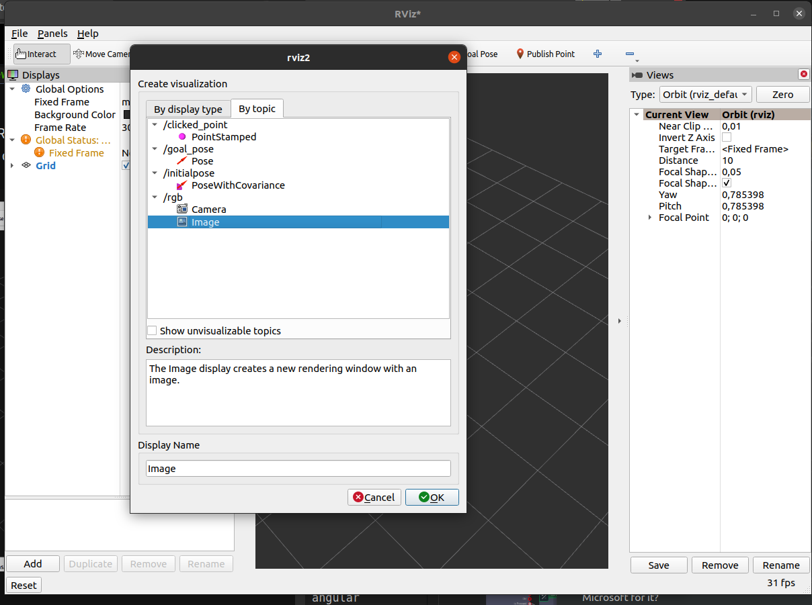
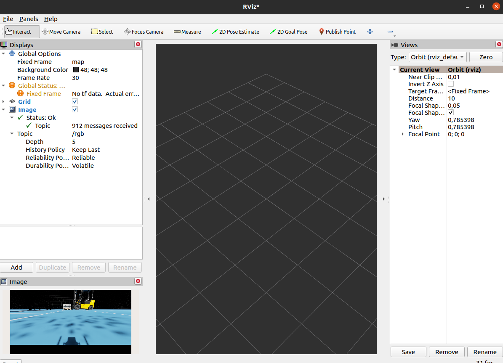
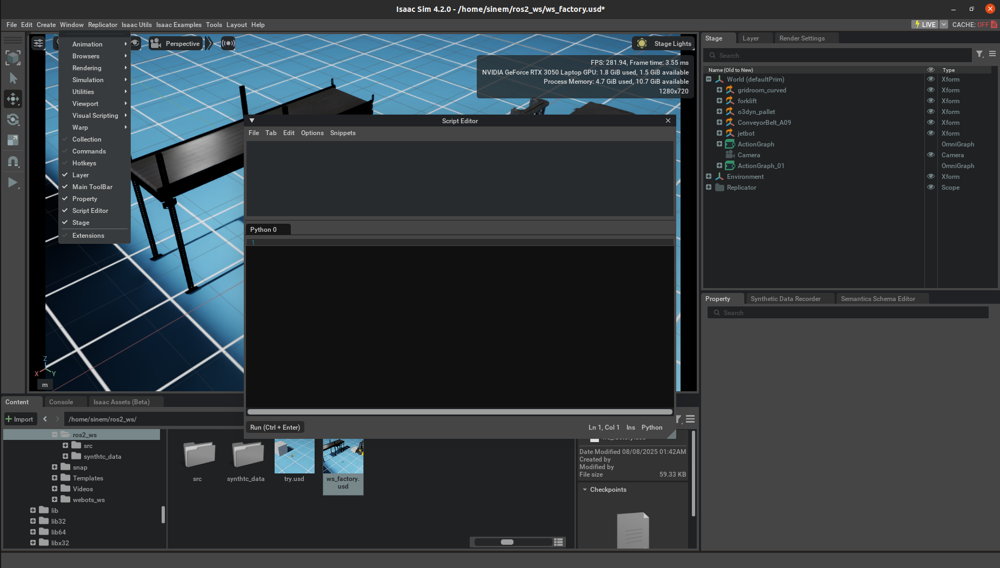
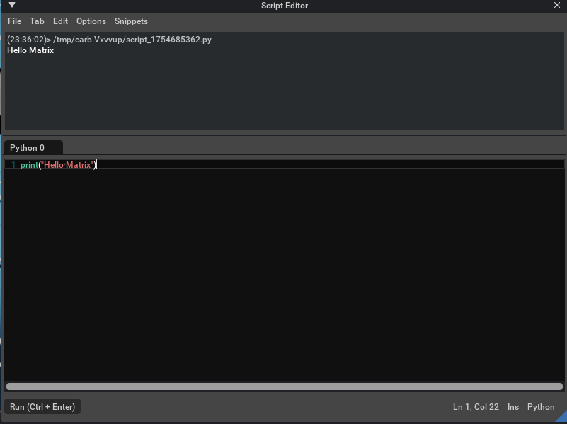

## Week 3 Camera Configurations and Python Scripting in Isaac Sim

This week is less busy compared to previous weeks, and I hope to improve that in the coming weeks. During this week, we will focus on connecting the camera to RViz and exploring how to use Python scripts in Isaac Sim.

- To complete these steps, you'll need to connect to ROS2, so please ensure that ROS2 is installed on your computer. Next, open Isaac Sim in **App Selector** mode to choose the ROS2 bridge. I was using ROS2 Foxy, which is why I downgraded my Isaac Sim version. However, if you are using Humble, you don't need to downgrade anything, as the two versions (4.2.0 - 4.5.0) are quite similar, with only minor differences. In the image below, you can see the **App Selector** section. You should select **omni.isaac.ros2_bridge** in the **ROS2 Bridge Extensions**. Additionally, to use the internal ROS2 libraries, make sure to choose either Foxy or Humble, depending on the version you are using.
</br>



</br>

- We can now open Isaac Sim with our ROS2 bridge connection, allowing us to connect our camera to RViz. To accomplish this, we will follow NVIDIA's original tutorial: which is initially for a camera in RViz; however, we will adapt it for the jetbot camera.
[Ros2 Camera Tutorial](https://docs.isaacsim.omniverse.nvidia.com/4.5.0/ros2_tutorials/tutorial_ros2_camera.html)

- In the **cameraPrim** section, make sure to select the jetbot camera to optimize the setup for our needs. You can change the topic name if you wish, but I will be keeping the default for now and will update it in the coming weeks. 

- Aside from that, you'll need to create the following graph, which I have included in the image. Make sure to configure the parameters according to the tutorial documentation. Once you have everything set up, you will need to open RViz from your terminal. I will also provide the necessary terminal commands below.
</br>



</br>

- Comment for sourcing the terminal.

```
    source /opt/ros/{ros-distro}/setup.bash
```

- Comment for seeing all the topics.

```
    ros2 topic list
```

- Comment for initializing RViz.

```
    rviz2
```

- After opening the RViz, press the **Add** button. A window will open where you can go through  **By topic** to find the **Image** related to the topic name you provide. For example, if I enter **rgb** as the topic name, the corresponding image will be displayed below the **/rgb**.
</br>



</br>

- In the bottom left window labeled "Image," you can see your camera's view. In this example, we observe the forklift and the pallet present in my environment.
</br>



</br>

- Now it's time to learn where you can write your scripts in Isaac Sim. When you open Isaac Sim, you can find the Script Editor at Window > Script Editor. Clicking on this option will open an empty Python file, allowing you to start writing your scripts.
</br>



</br>

- Script Editor is especially useful for automating tasks, controlling simulations, spawning robots or objects, integrating sensors, and testing robotics algorithms in real time. Even if you’ve never used Isaac Sim before, you can think of it as a “control panel” where you type Python code that interacts instantly with the virtual world. 
</br>

