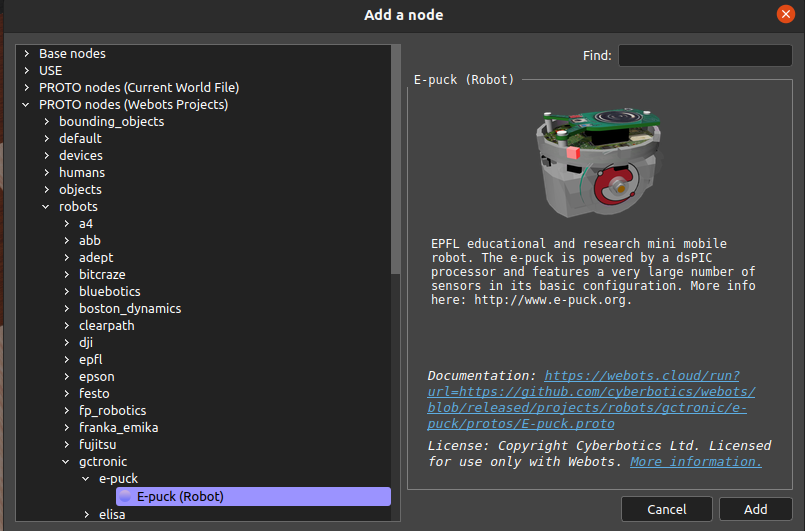

## Week 6 First Robot at Webots

https://github.com/user-attachments/assets/8270da4d-5f48-4329-bd68-228a49d77a9c

In this week, we will focus on integrating a pre-made project from Webots, specifically experimenting with the adorable e-puck robot. If you're more familiar with IsaacSim, you can also explore the Jetson options available.
 
 

 

To get started with the e-puck, I’m following a helpful video and the earlier tutorials from this channel that cover Webots.
 
[Full Tutorial](https://www.youtube.com/playlist?list=PLbEU0vp_OQkUwANRMUOM00SXybYQ4TXNF)
 

 In this part, we make the e-puck, and we took a closer look at the controller to gain some foundational knowledge about how to access it and the overall structure. 
 

 

 

Afterward, we'll move on to building our own robot. In the next video, there will be an explanation of this process, and we’ll also get the chance to run our cute creation.

 

I've completed half of the video for my robot, focusing on its forward movement for now. You can follow the tutorial for guidance. In this section, we will write the controller for our cute robot. The controller code looks like this before editing.
 

 

 After we write the necessary functions for moving forward, it appears as follows: 
 

**Warning!** You actually need to multiply `max_speed` by 0.5. However, when I do that, my robot moves backward. I suspect this issue might be related to some changes in the default environment setup. I remember I changed the empty board before starting the simulation, and that could be the cause, but I'm not entirely sure. Interestingly, when you multiply `max_speed` by -0.5, the robot should move backward.

 

[Official documentation for further function information.](https://www.cyberbotics.com/doc/reference/introduction?tab-language=python)

 

