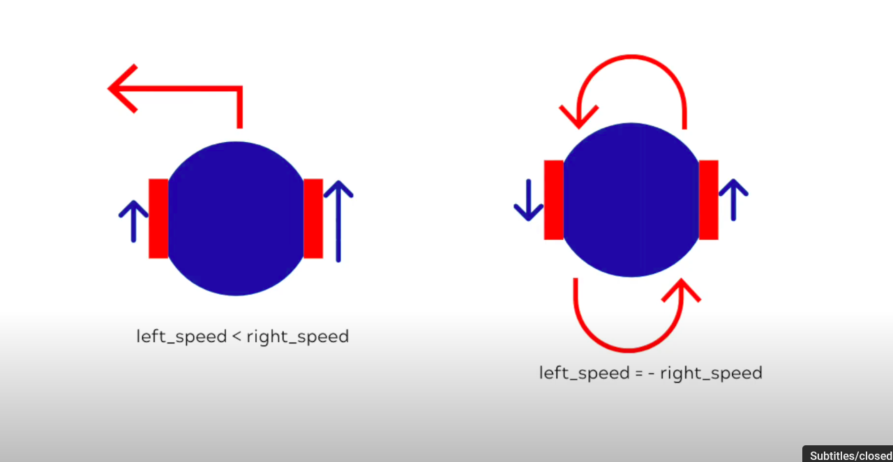

## Week 7

https://github.com/user-attachments/assets/bc27127c-8029-4be7-af88-4af9d18f4860

This week, we will be writing controllers to operate our small robot, as well as a controller for determining the robot's position using odometry. I am following [the video tutorial](https://www.youtube.com/playlist?list=PLbEU0vp_OQkUwANRMUOM00SXybYQ4TXNF), specifically the third and fourth videos, so I don’t have a lot of visual documentation of my work. However, I have put together a few small elements.

 

 

In the overall image, you can see how to turn a robot in two different ways. There is a significant amount of technical and mathematical background involved in this process. Documentation is available in the description of the video, primarily sourced from Webots original document. 

To help with understanding the basics, we have written a code that allows our robot to [drive around](drive_my_robot.py). First, we implement the forward method, which moves the robot in a straight line. However, when I tried to replicate what was shown in the video, my robot unexpectedly moved backward due to some differences. To address this issue, I adjusted the maximum speed by adding a negative sign. ( Normally, it should go backward when we add a negative sign to both speeds. )

For turning, we also use a negative value. We set one motor to a negative speed and the other to a positive speed, allowing the robot to turn effectively. Overall, everything is functioning well.

After successfully moving our robots forward, we proceed to maneuver them in a square pattern according to the floor plan. To achieve this, we need to adjust our code so that the robots can navigate around the corners of the square. However, after some time, we notice that the robots tend to shift away from the intended path. To understand their actual positions and make necessary adjustments, we need to determine [the odometry](odometer_calculation.py) of the robots.

In the odometry code, we are capturing the position sensor values, and robot pose, which is the key part we need. While monitoring the robot's position, I've noticed that when the robot moves forward, the reported position consistently shows zero. I'm unsure why this is happening, as the code functions perfectly for other movements, such as turning around or moving backward. Everything works well except for the forward movement, where the robot's position is recorded as zero. I still haven't determined the cause, but the situation resembles the video below.

https://github.com/user-attachments/assets/e531f181-f5a5-44b7-90e4-8685fa0803d8

Next week, we will continue working on the Line Follower robot as part of a Webots tutorial. I will also try to resolve my Isaac Sim issue. I’ve received some helpful advice on LinkedIn, and I want to thank everyone who liked and offered suggestions. I plan to explore IsaacLab in order to understand how to correctly run my Python script in Isaac Sim. 

To be honest, I find that Webots offers much better simulation features for executing Python scripts. Even if I manage to solve the Isaac Sim problem, I will complete the project I’ve started, but I anticipate moving on to other projects with Webots afterward. It seems to provide a better working experience, and I have more control over my robot, allowing me to make any necessary adjustments.

While Isaac Sim does have its own advantages, I have noticed a lack of tutorials and explanations, which makes it more challenging to work with compared to Webots. Therefore, in the coming week, I will focus on that. My hope is that by the ninth week of this journey, I will be ready to start creating my own projects from scratch. I’m determined to achieve this. Thank you for reading!
