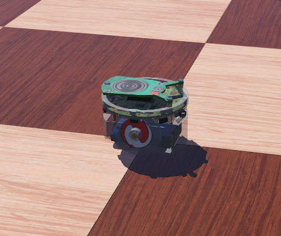
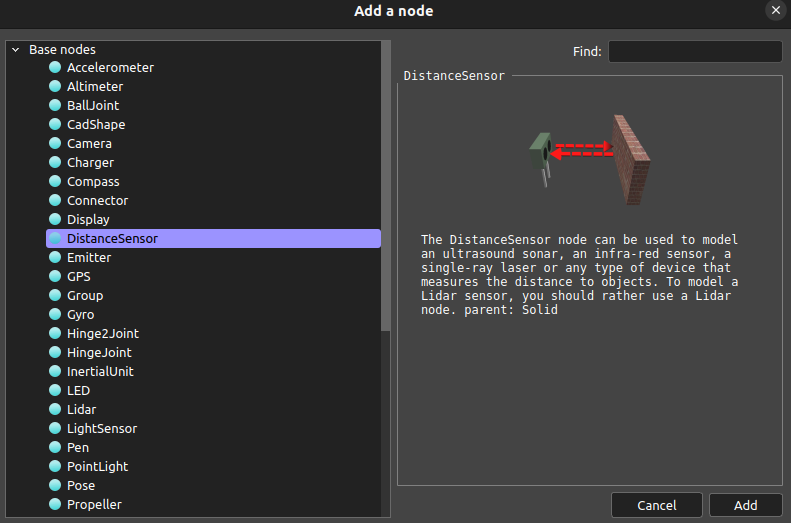
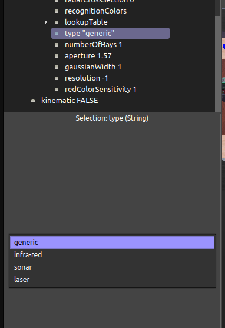
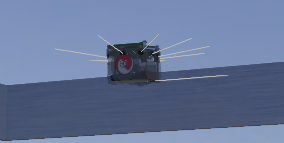
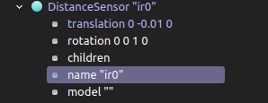
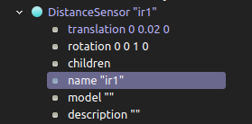
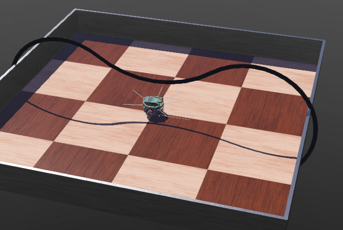
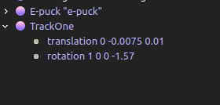
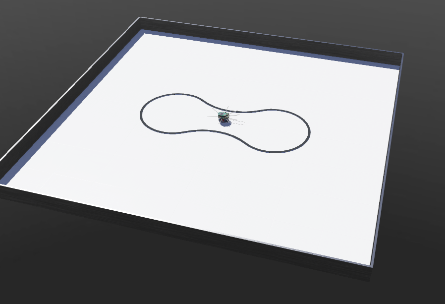
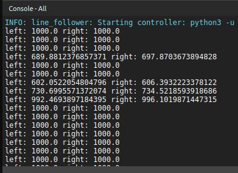

## Week 8  The Line Controller (Failed)

Another week, another setback. This week, I had planned to build a line-following robot using Webots, but unfortunately, I wasn't able to get it to work. I couldn't figure out why my robot wasn't following the line. However, I will outline the steps to make one, as it might work for you. I'm not entirely sure why I encountered these issues.

As for the Isaac Sim project, I haven't had a chance to explore it yet. Next week, I plan to revisit all of my challenging projects and work on fixing them. Let's get started!

I have followed this video tutorial: [The Line Follower](https://www.youtube.com/watch?v=D0jhvFZJ5Ok&list=PLbEU0vp_OQkUwANRMUOM00SXybYQ4TXNF&index=17
)

For this line-following robot, we will use a simple e-puck robot.
 

 

 After we build our environment, we need to put some distance sensors to detect the line and enable the robot to follow it. We will place two distance sensors: one on the right side and one on the left side. You can position the distance sensors as shown in the image below. 
 

 
There are several types of distance sensors, but we are going to use infra-red sensor type.
 

 
Once the sensors are set, they will appear as indicated in our environment. 
 

 
Additionally, we have changed the names and positions of the sensors, and the modifications look like this.
 

 

After setting up our distance sensors, we need to create a track for our robot to follow. You can find this track in this [GitHub repository.](https://github.com/KajalGada/Youtube-Tutorial-Download-Material/tree/main/Line%20Follower%20Webots%20Tutorial)

 The tracks are sourced from a specific YouTube channel [DrakerDG](https://www.youtube.com/@DrakerDG/videos), and more tracks can also be found in their [GitHub repository.](https://github.com/DrakerDG/Line-Follower-Robot-V4/tree/master) If you prefer not to access those resources, I've included the track we are using in our files for direct access: [Track One](TrackOne.proto)

Once the track is in place, it looks like this.
 

 

 We need to adjust the position of the track.
  

  

Also, we need to modify the appearance of the floor, which has been demonstrated on the YouTube channel, so I won't go into detail about that here. Final world looks like this:
 

 

Next, we're going to start writing our controller, and I will share all the code I've written so far: [Line Follower Controller](line_follower.py)  

Unfortunately, it isn’t functioning properly as shown in the YouTube tutorial. In my case, it seems to return a value of 1000 for both the right and left distance sensors, and I am having trouble identifying the issue. 
 

 

This is all I've been able to accomplish this week. Thank you for reading!

