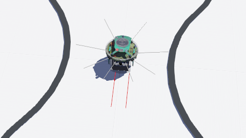
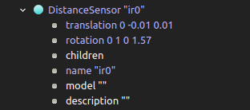
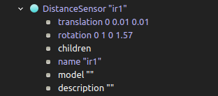
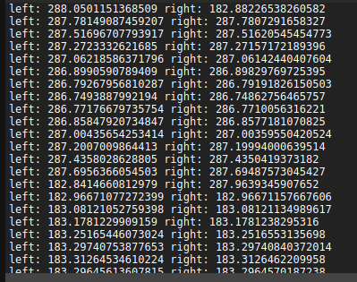
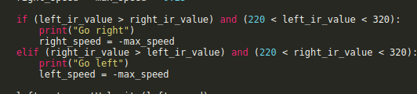

## Week 9 The Line Follower (Fixed)

https://github.com/user-attachments/assets/f899bae6-c369-41a7-9d93-dadfa32d8f9f

This week, we will identify the issues with the line follower robot and address them step by step. I have successfully configured the correct settings, and now the line follower is functioning properly. I will explain what parts were incorrect and show the current versions of those components. Let's get started!

The first issue we encountered was the positioning of the distance sensors. They were intended to point downward; however, as shown in the image below, they were not correctly aligned. This misalignment caused our sensors to fail in accurately detecting the line on the floor.
 

 

To fix the positions of the sensors, we need to rotate them. Additionally, I've noticed that the translations in the tutorial video were incorrect for our environment. Therefore, I've made changes to the translations as well. The updated changes are shown in the images below.
 

 

After these changes, the readings from the distance sensor are displayed as shown in the image below.
 

 

The last problem was related to the code. Firstly, I mixed up the logic for going right and going left in my original code, so I have made the necessary corrections. Additionally, I adjusted the range values in the if statements based on our distance readings. Currently, I am using 220 and 320 as the range values. You will need to modify these numbers according to your distance sensor readings, as shown in the image below. Keep in mind that these values may differ for your specific case. I have included all the updated code as well: [Corrected Code](line_follow.py)
 

 

After addressing these issues, my robot functions correctly, and it has already been demonstrated in the video from the first part.

As you may recall, I have another issue related to the IsaacSim project that I'm currently working to resolve. However, it will take some time, so I expect to have it fixed by next week. In the meantime, I have downloaded IsaacLab, and I will share some links for [downloading IsaacLab](https://isaac-sim.github.io/IsaacLab/main/source/setup/quickstart.html
) along with [tutorials](https://isaac-sim.github.io/IsaacLab/main/source/tutorials/index.html
) and [documentation](https://isaac-sim.github.io/IsaacLab/main/index.html).

